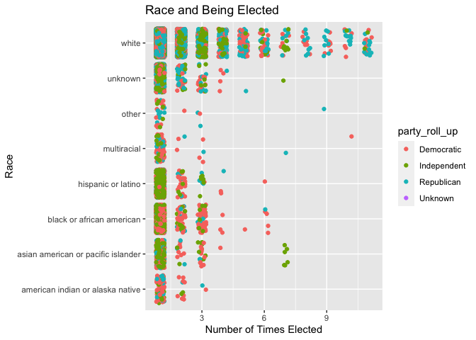
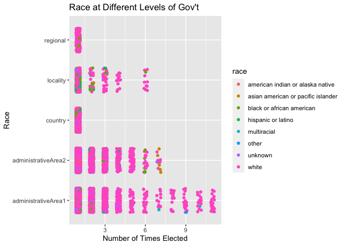

<!-- README.md is generated from README.Rmd. Please edit that file -->

# PoliticalCandidates2019

<!-- badges: start -->


<!-- badges: end -->

The goal of PoliticalCandidates2019 is to be able to provide a framework
to work with data that contains information on those that ran and for
political offices all across the country at all the different levels of
government and whether or not they won their race. The data available in
this package also contains demographic information of the candidates
themselves such as race and gender as well as the party they chose to
affiliate themselves with. This data can be useful in being able to see
and answer questions that breakdown these candidates by areas such as by
levels of office, by state, by party, or by gender just to list a few
examples. \#\# Installation

You can install the released version of PoliticalCandidates2019 from
[CRAN](https://CRAN.R-project.org) with:

``` r
install.packages("PoliticalCandidates2019")
```

And the development version from [GitHub](https://github.com/) with:

``` r
# install.packages("devtools")
devtools::install_github("gchickering21/PoliticalCandidates2019")
```

## Examples

These are a few basic examples which shows you the type of questions
that can be answered by looking at this dataset.

``` r
library(PoliticalCandidates2019)
library(tidyverse)
options(dplyr.summarise.inform = FALSE)
library(knitr)
library(kableExtra)
```

This is an example showing how you can see the gender breakdown of who
ran for positions at all levels of government.

``` r
gender_percents <- PoliticalCandidates2019 %>%
  select(gender) %>%
  group_by(gender) %>%
  summarize(count = n()) %>%
  mutate(percentage = count / sum(count) * 100)
knitr::kable(gender_percents)
```

<table>

<thead>

<tr>

<th style="text-align:left;">

gender

</th>

<th style="text-align:right;">

count

</th>

<th style="text-align:right;">

percentage

</th>

</tr>

</thead>

<tbody>

<tr>

<td style="text-align:left;">

female

</td>

<td style="text-align:right;">

10742

</td>

<td style="text-align:right;">

31.6639646

</td>

</tr>

<tr>

<td style="text-align:left;">

male

</td>

<td style="text-align:right;">

22137

</td>

<td style="text-align:right;">

65.2527634

</td>

</tr>

<tr>

<td style="text-align:left;">

other

</td>

<td style="text-align:right;">

1

</td>

<td style="text-align:right;">

0.0029477

</td>

</tr>

<tr>

<td style="text-align:left;">

unknown

</td>

<td style="text-align:right;">

1045

</td>

<td style="text-align:right;">

3.0803242

</td>

</tr>

</tbody>

</table>

This is another example where we can see the racial demographics of the
different types of candidates running for office.

``` r
race_percents <- PoliticalCandidates2019 %>%
  select(race) %>%
  group_by(race) %>%
  summarize(count = n()) %>%
  mutate(percentage = count / sum(count) * 100) %>%
  arrange(desc(percentage))
knitr::kable(race_percents)
```

<table>

<thead>

<tr>

<th style="text-align:left;">

race

</th>

<th style="text-align:right;">

count

</th>

<th style="text-align:right;">

percentage

</th>

</tr>

</thead>

<tbody>

<tr>

<td style="text-align:left;">

white

</td>

<td style="text-align:right;">

28577

</td>

<td style="text-align:right;">

84.2358143

</td>

</tr>

<tr>

<td style="text-align:left;">

black or african american

</td>

<td style="text-align:right;">

2029

</td>

<td style="text-align:right;">

5.9808401

</td>

</tr>

<tr>

<td style="text-align:left;">

unknown

</td>

<td style="text-align:right;">

1614

</td>

<td style="text-align:right;">

4.7575534

</td>

</tr>

<tr>

<td style="text-align:left;">

hispanic or latino

</td>

<td style="text-align:right;">

1076

</td>

<td style="text-align:right;">

3.1717023

</td>

</tr>

<tr>

<td style="text-align:left;">

asian american or pacific islander

</td>

<td style="text-align:right;">

361

</td>

<td style="text-align:right;">

1.0641120

</td>

</tr>

<tr>

<td style="text-align:left;">

american indian or alaska native

</td>

<td style="text-align:right;">

128

</td>

<td style="text-align:right;">

0.3773029

</td>

</tr>

<tr>

<td style="text-align:left;">

multiracial

</td>

<td style="text-align:right;">

106

</td>

<td style="text-align:right;">

0.3124539

</td>

</tr>

<tr>

<td style="text-align:left;">

other

</td>

<td style="text-align:right;">

34

</td>

<td style="text-align:right;">

0.1002211

</td>

</tr>

</tbody>

</table>

This is another example that shows a breakdown of how often a party won
a race, broken down by the different levels of government.

``` r
level_party_percents <- PoliticalCandidates2019 %>%
  select(office_level, party_roll_up, winner_y_n) %>%
  filter((party_roll_up == "Democratic" | party_roll_up == "Republican" 
          | party_roll_up == "Independent") & winner_y_n == "Yes") %>%
  group_by(office_level, party_roll_up) %>%
  summarize(count = n()) %>%
  mutate(percentage = count / sum(count) * 100) %>%
  select(office_level, party_roll_up, percentage)


level_party_percents %>%
  pivot_wider(names_from = "party_roll_up", values_from = "percentage") %>%
  arrange(desc(office_level)) %>% knitr::kable()
```

<table>

<thead>

<tr>

<th style="text-align:left;">

office\_level

</th>

<th style="text-align:right;">

Democratic

</th>

<th style="text-align:right;">

Independent

</th>

<th style="text-align:right;">

Republican

</th>

</tr>

</thead>

<tbody>

<tr>

<td style="text-align:left;">

regional

</td>

<td style="text-align:right;">

49.35065

</td>

<td style="text-align:right;">

2.5974026

</td>

<td style="text-align:right;">

48.051948

</td>

</tr>

<tr>

<td style="text-align:left;">

locality

</td>

<td style="text-align:right;">

25.42373

</td>

<td style="text-align:right;">

70.7627119

</td>

<td style="text-align:right;">

3.813559

</td>

</tr>

<tr>

<td style="text-align:left;">

country

</td>

<td style="text-align:right;">

54.89362

</td>

<td style="text-align:right;">

0.6382979

</td>

<td style="text-align:right;">

44.468085

</td>

</tr>

<tr>

<td style="text-align:left;">

administrativeArea2

</td>

<td style="text-align:right;">

27.06447

</td>

<td style="text-align:right;">

10.3155007

</td>

<td style="text-align:right;">

62.620027

</td>

</tr>

<tr>

<td style="text-align:left;">

administrativeArea1

</td>

<td style="text-align:right;">

47.49047

</td>

<td style="text-align:right;">

1.8583227

</td>

<td style="text-align:right;">

50.651207

</td>

</tr>

</tbody>

</table>

This is another example of a type of plot that could be generated by the
data in this package where we examine the relationship between number of
times elected by race for the different political parties.

``` r
ggplot(PoliticalCandidates2019, aes(x = number_elected, y = race, color = party_roll_up)) +
  geom_point(position = position_jitter(width = 0.2, height = 0.4)) +
  labs(x = "Number of Times Elected", y = "Race", title = "Race and Being Elected")
#> Warning: Removed 68 rows containing missing values (geom_point).
```



This is one last example that shows how one can examine the relationship
between number of times elected by race at the different levels of
government.

``` r
ggplot(PoliticalCandidates2019, aes(x = number_elected, y = office_level, color = race)) +
  geom_point(position = position_jitter(width = 0.15, height = 0.3)) +
  labs(x = "Number of Times Elected", y = "Race", title = "Race at Different Levels of Gov't")
#> Warning: Removed 68 rows containing missing values (geom_point).
```


These are just a couple examples of the types of information that can be
drawn and the analysis that can be done with the data from this R
Package.
